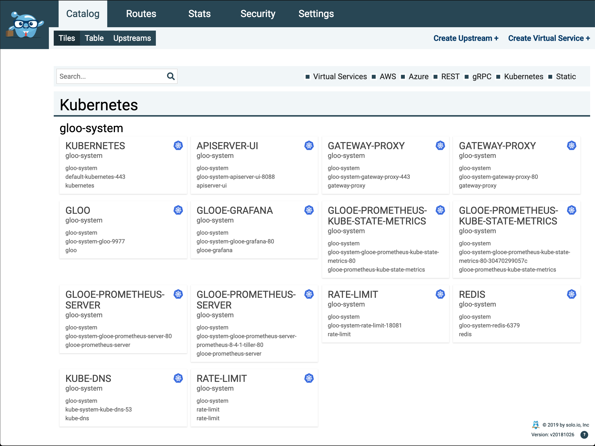
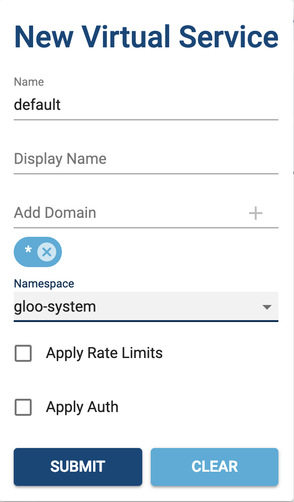
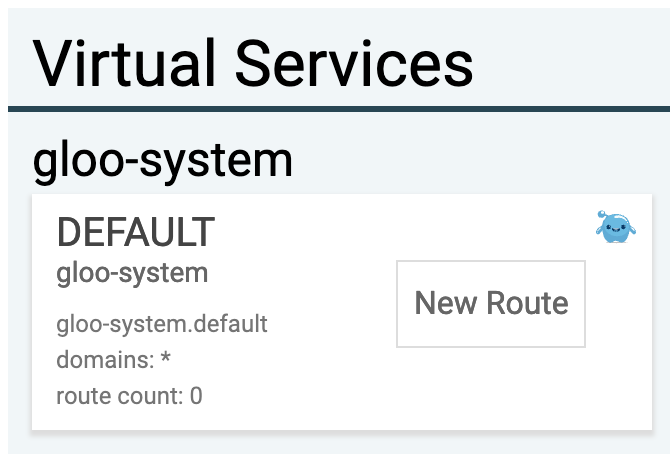
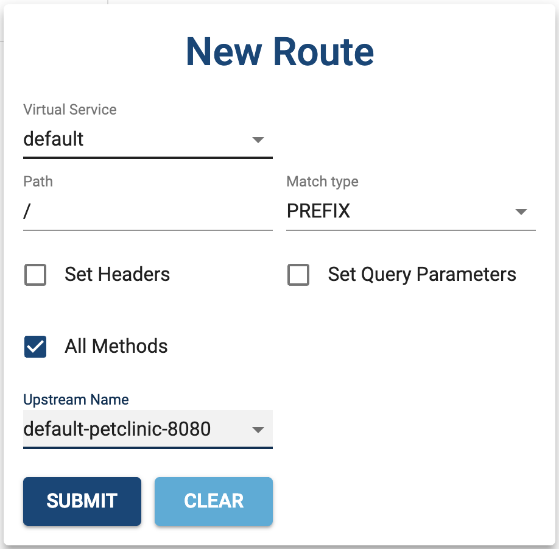
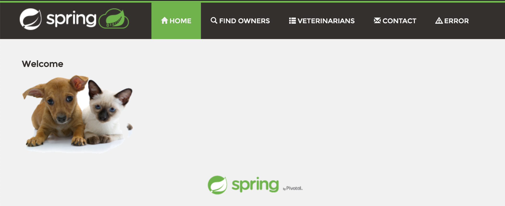
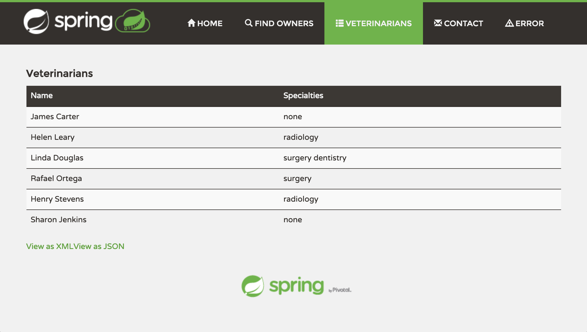
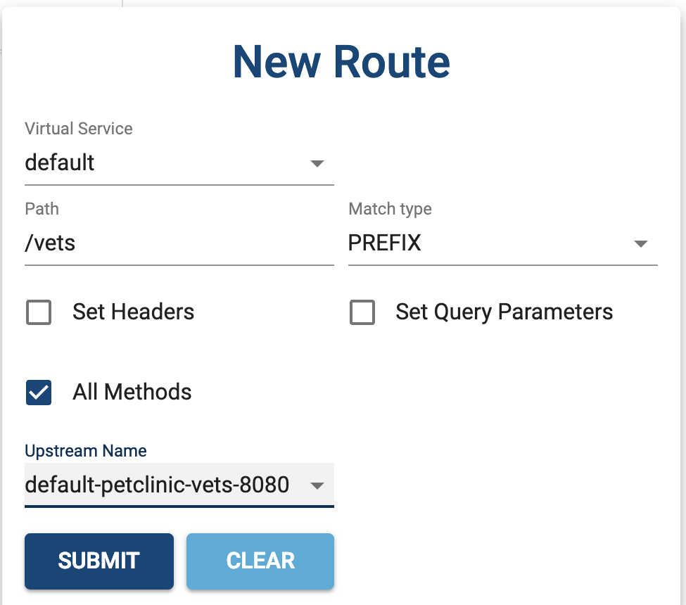
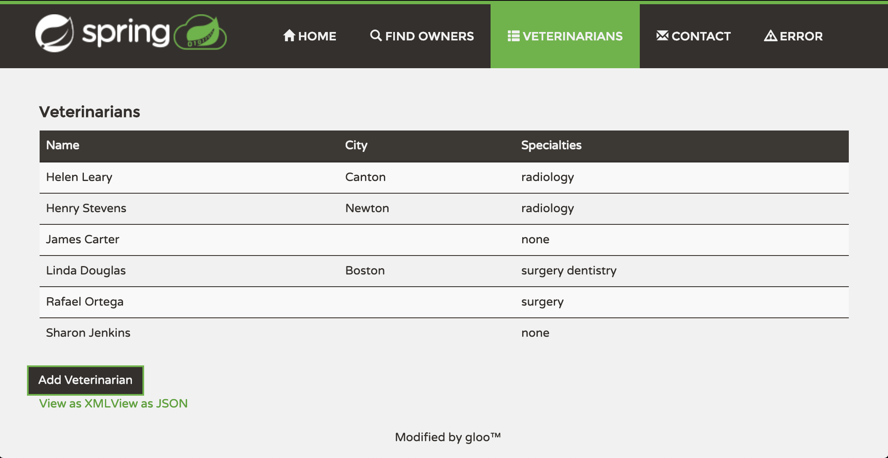

This is a quick walk through guide on using the Gloo Enterprise Console. This guide will show you how to create a route
rules (proxy) to a monolith application, and then re-directing a page request to a new microservice.

## Route Rule to an Existing Application

This example will show creating route rules in Gloo to a "Lift and Shift" monolith application hosted in Kubernetes.

1. Install example application into your Kubernetes cluster. This is the classic Spring PetClinic application that has been moved into a container.

    ```shell
    kubectl apply \
        --namespace default \
        --filename https://raw.githubusercontent.com/solo-io/gloo/master/example/petclinic/petclinic.yaml
    ```

1. Open the Gloo Enterprise console

  * The most consistent way to access the Gloo Enterprise Console deployed in any Kubernetes cluster is to use the
  `kubectl port-forward` command. The following command will give you access to the console in your local web browser
  at <http://localhost:8088>
  
        ```shell
        kubectl port-forward --namespace gloo-system deploy/api-server 8088:8088
        ```

  * If you're running `minikube`, the quick way to open the Gloo Enterprise Console is the following command, which
    will automatically open the console in a browser window.

        ```shell
        minikube service --namespace gloo-system apiserver-ui
        ```

        You can use the `--url` option to see the url.

        ```shell
        minikube service --namespace gloo-system apiserver-ui --url
        ```

  * Otherwise, you can get your Kubernetes Cluster IP using `kubectl cluster-info`. In this example, my Cluster IP is
`192.168.99.102`; where the Kubernetes master is running.

        ```shell
        kubectl cluster-info

        Kubernetes master is running at https://192.168.99.102:8443
        KubeDNS is running at https://192.168.99.102:8443/api/v1/namespaces/kube-system/services/kube-dns:dns/proxy

        To further debug and diagnose cluster problems, use 'kubectl cluster-info dump'.
        ```

        And the console port number using the following. In this example, the port number is `31242`.

        ``` shell
        kubectl get service --namespace gloo-system apiserver-ui

        NAME           TYPE       CLUSTER-IP     EXTERNAL-IP   PORT(S)          AGE
        apiserver-ui   NodePort   10.97.69.208   <none>        8088:31242/TCP   129m
        ```

        So to open the Gloo Enterprise Console, in this example, I'd open a browser to `192.168.99.102:31242`.

1. Your console should look something like the following.

    

1. Create a new Virtual Service.

    * Click on the `Create Virtual Service +` link in the upper right corner of the console.

    

    * In the New Virtual Service pop up, enter the following information.

       * Name: `default`
       * Add Domain: `*` and click on `+`
       * Namespace: `gloo-system`
       * Click Submit

       

1. Add a route by right clicking in the `DEFAULT` Virtual Service, and selecting `New Route` in the pop up.

    

    * In the New Route pop up, enter the following information.

        * Virtual Service: `default`
        * Path: `/`
        * Upstream Name: `default-petclinic-8080`
        * Click Submit

        

1. Test the route.

    * Get Gloo gateway url. The following command will return the base url for the Gloo Gateway proxy. Since we setup
    our route rules for `/` for the petclinic app, you can open your browser to the url returned by the following
    command.

    ```shell
    glooctl proxy url
    ```

    * You should see the petclinic app in your browser

    

## Routing Rule to Redirect a Page Request in an Existing Application

In the petclinic application, if you click on the `Veterinarians` tab you will see a table with 2 columns. Let's say
that our team created a new microservice `petclinic-vet` that returns a new 3 column table with additional information
our customers want. This example will show how to redirect a page (HTTP GET) request such that we can enhance the
functionality of our application **without** needing to change the original monolithic petclinic application. This
allows you to provide new functionality independent of efforts to change original code.



Let's create a new route rule to redirect requests to `/vets` to our new microservice

1. On the Catalog tab of the Gloo Enterprise Console, right click on the `DEFAULT` Virtual Service to add a new route.

    

    * In the New Route pop up, enter the following information.

        * Virtual Service: `default`
        * Path: `/vets`
        * Ensure Match type is set to `PREFIX` (default)
        * Upstream Name: `default-petclinic-vets-8080`
        * Click Submit

        

1. On the Routes tab of the Console, on the `default` Virtual Service expand the routes, and re-order the routes so that
`/vets` is first. That way the `/vets` path prefix will be matched before `/`.

    

1. Test the new route by refreshing the petclinic app, and clicking on the `VETERINARIANS` tab. If the redirect route
rule is working correctly, you should now see 3 columns in the Veterinarians table.

    

## Summary

This guide hopefully gave you a taste for how Gloo Enterprise can help you solve some of your challenges. Please
look at the rest of our documentation for more information on using Gloo.