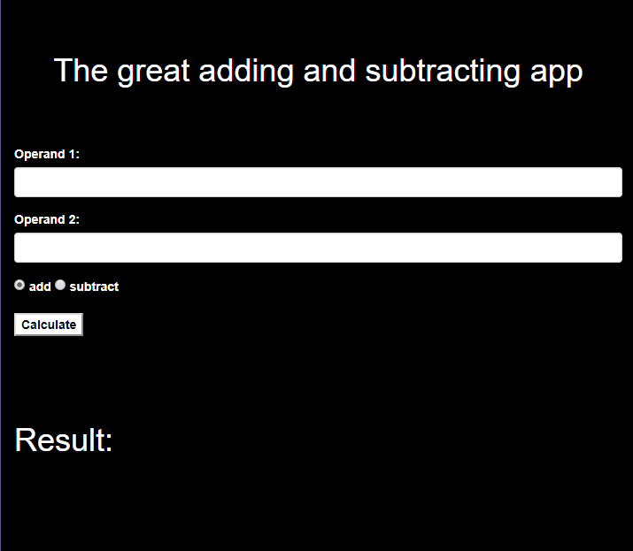
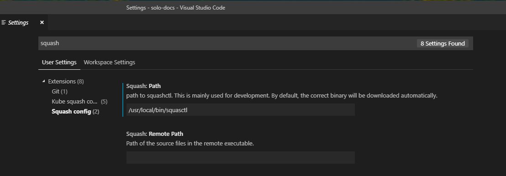
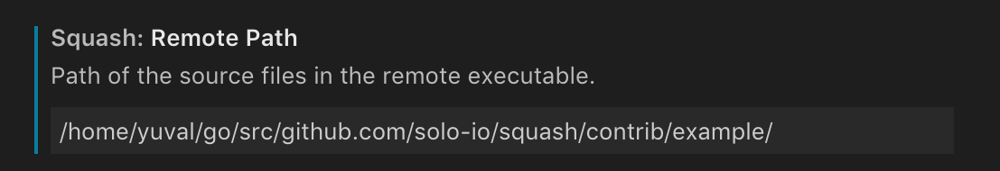
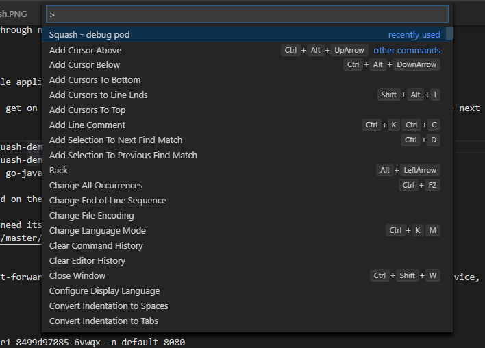
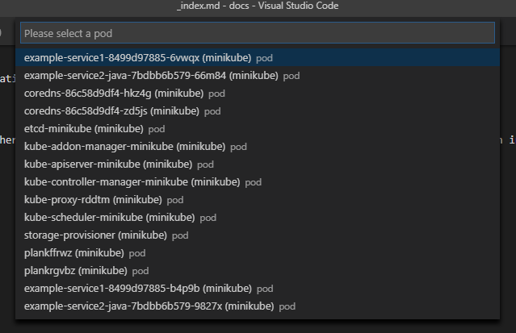
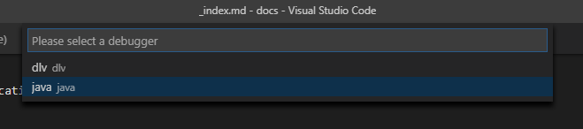

# Download and Install Squash

If you are using [Homebrew](https://brew.sh) package manager you can install `squashctl` with the following command.

```shell
brew install squashctl
```

You can also download by going to our releases page <https://github.com/solo-io/squash/releases>. Once you download, you
should add `squashctl` to your `$PATH` TO facilitate usage.

# Debugging your first microservice

You can debug your application from an IDE or via the `squashctl` CLI. First, let's deploy an app.

## Option 1: Deploy a sample app

For convenience, you can deploy a sample microservice with the `squashctl` command line tool.
An interactive prompt will guide you through namespace and sample app selection.

```bash
squashctl deploy demo
```

For this exercise, let's deploy a sample applications that contains a Go and Java Service. When you run the command
above, you'll get on the interactive mode of the CLI, which will make it easy for you to select the next steps. Choose
`go-java` option to deploy for this demo application session.

```bash
squashctl deploy demo
? Choose a demo microservice to deploy go-java
```

Your application should now be deployed on the selected namespace.

In order to debug the application we need its source code: here's the source for the application we are going to debug:
<https://github.com/solo-io/squash/tree/master/contrib/example/service2-java>

To quickly run this example, let's port-forward from the application's Service. If you have other mechanisms to access the service, like via [Gloo](https://gloo.solo.io) or an ingress service, that will also work.

```bash
kubectl --namespace default port-forward service/example-service1 8080:80

Forwarding from 127.0.0.1:8080 -> 8080
Forwarding from [::1]:8080 -> 8080
Handling connection for 8080
```

Access <http://localhost:8080> on your preferred browser to see the demo calculator application.



## Option 2: Build a sample app from source

{}

If you prefer to build the demo app yourself, a complete source-to-deployment workflow is outlined below.

### Prerequisites

* A Kubernetes cluster with [kubectl configured](https://kubernetes.io/docs/tasks/tools/install-kubectl/#configure-kubectl).
* Go and DLV Go debugger installed
* Squash server, client and command line binary [installed](https://github.com/solo-io/squash/blob/master/README.md).
* Docker repository that you can push images to, and that Kubernetes can access (eg, docker hub)

In your favorite text editor, create a new `main.go` file. Here's the one we will be using in this tutorial:

```go
package main

import (
	"encoding/json"
	"fmt"
	"log"
	"net/http"
)

type Calculator struct {
	Op1, Op2 int
	IsAdd    bool
}

func main() {
	http.HandleFunc("/calculate", calchandler)

	log.Fatal(http.ListenAndServe(":8080", nil))
}

func calchandler(w http.ResponseWriter, r *http.Request) {
	var req Calculator
	dec := json.NewDecoder(r.Body)
	err := dec.Decode(&req)
	if err != nil {
		w.WriteHeader(http.StatusBadRequest)
	}

	isadd := req.IsAdd
	op1 := req.Op1
	op2 := req.Op2

	if isadd {
		fmt.Fprintf(w, "%d", op1-op2)
	} else {
		fmt.Fprintf(w, "%d", op1+op2)
	}
}
```

### Build a docker container

In the same folder as `main.go` add a `Dockerfile`:

```shell
FROM alpine
COPY microservice /microservice
ENTRYPOINT ["/microservice"]

EXPOSE 8080
```

To build everything conveniently, you can add a `Makefile` (replace  <YOUR REPO HERE> with the appropriate value):

```shell
microservice:
	GOOS=linux CGO_ENABLED=0 go build -gcflags "-N -l" -o microservice
	docker build -t <YOUR REPO HERE>/microservice:0.1 .
dist:
	docker push <YOUR REPO HERE>/microservice:0.1
```

`CGO` is disabled as it is not compatible with the alpine image. The `gcflags` part adds more debug information for the debugger.

Overall your directory should have three files so far:

* Dockerfile
* main.go
* Makefile

Finally, execute

```shell
make microservice && make dist
```

to build and deploy the microservice.

### Deploy the microservice to kubernetes

Create a manifest for kubernetes named `microservice.yml`

```yaml
apiVersion: v1
kind: ReplicationController
metadata:
  name: example-microservice-rc
spec:
  replicas: 1
  selector:
    app: example-microservice
  template:
    metadata:
      labels:
        app: example-microservice
    spec:
      containers:
      - name: example-microservice
        image: <YOUR REPO HERE>/microservice:0.1
        ports:
        - containerPort: 8080
          protocol: TCP
---
kind: Service
apiVersion: v1
metadata:
  name: example-microservice-svc
spec:
  selector:
    app: example-microservice
  ports:
    - protocol: TCP
      port: 80
      targetPort: 8080
```

and deploy it to kubernetes:

```shell
kubectl create --filename microservice.yml
```

{}

# Debug

Now that you have a microservice deployed to Kubernetes you can debug it with Squash.

## IDEs

### Quick Start for Visual Studio Code

The first thing you have to do is download the Squash Extension for Visual Studio Code.
Go to the Extension settings and select "Squash".

You should see a screen similar to the one below.


The Next step is to tell the Squash extension the location of the `squashctl` CLI.

Open **Settings** (Code > Preferences > Settings) on Visual Studio Code, and then search for Squash. Once you find Squash, change the value of Path to point to the location of the CLI.



If the target process was compiled from a different sourcepath, you should also [specify the remote path](/configuration/#source-code-mapping).
In this quick start, if you choose go-go app, you have to set `Squash: Remote Path` in VSCode User Settings.
Please set `Squash: Remote Path` to `/home/yuval/go/src/github.com/solo-io/squash/contrib/example/`.



If there is an error such as `Error on CreateBreakpoint: could not find /Users/<YourName>/squash/contrib/example/service1/main.go`,
please correct its remote path in order to match `/home/yuval/go/src/github.com/solo-io/squash/contrib/example/service1/main.go`.

After installing the extension on VS Code, use the shortcut CTRL + SHIFT + P to show all commands and select Squash.



Once you select squash you can proceed to select the Pod.



...and the Type of Debugger you Want to use.



After that, Squash will spin up a debugger Pod on your Kubernetes cluster, and Switch VS Code to Debug mode. Once that is done, you can add your breakpoints and proceed with debugging as you always did.

## Command Line Interface

A single command is all you need:

```shell
squashctl
```

* `squashctl` opens an interactive dialog and guides you through the following steps:
  * Choose a debugger to use
  * Choose a namespace to debug
  * Choose a pod to debug
  * Choose a container to debug
* When these values have been selected, Squash opens a debug session in you terminal.
