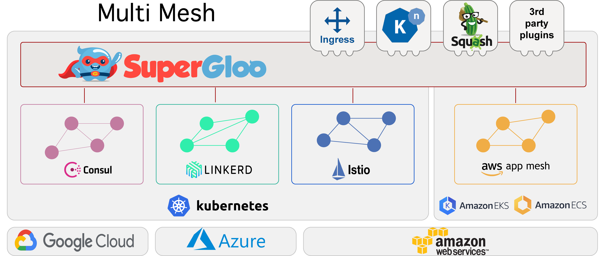

<h1 align="center">
    
   
  The Service Mesh Orchestration Platform
</h1>

SuperGloo, an open-source project to manage and orchestrate service meshes at scale. SuperGloo is an opinionated abstraction layer that will simplify the installation, management, and operation of your service mesh, whether you use (or plan to use) a single mesh or multiple mesh technologies, on-site, in the cloud, or on any topology that best fits you. 

[**Installation**](installation.md) &nbsp; |
&nbsp; [**Developers**](developers.md) &nbsp; |
&nbsp; [**Documentation**](https://supergloo.solo.io) &nbsp; |
&nbsp; [**Blog**](https://medium.com/solo-io/https-medium-com-solo-io-supergloo-ff2aae1fb96f) &nbsp; |
&nbsp; [**Slack**](https://slack.solo.io) &nbsp; |
&nbsp; [**Twitter**](https://twitter.com/soloio_inc)

 

## Summary

- [**Why SuperGloo?**](#why-supergloo)
- [**Features**](#features)
- [**Features Snapshot**](#features-snapshot)
- [**Roadmap**](#Roadmap)
- [**Vision**](#vision)

  
## Why SuperGloo?

**SuperGloo helps users kick off their service mesh experience.** Users who contemplate working with service mesh can be deterred by the many configuration choices they have to make. SuperGloo solves this problem by providing an opinionated API that automates the installation process, obviating the need for writing and deploying complicated yaml files. 

**SuperGloo takes charge of key functionalities associated with the mesh, including encryption, telemetry, and tracing.** Launching any of these with SuperGloo is as simple as flipping a switch, completely bypassing the need for complicated configuration steps. 

**SuperGloo unifies management of ingress traffic (“north/south”) and mesh traffic (“east/west”).** Every service mesh relies on ingress controllers to manage traffic across clusters and from the internet. SuperGloo provides a fully-automated opinionated workflow for configuring your mesh to work with your ingress, offering a unified management experience for all traffic.

**SuperGloo gives you the freedom to pair any service mesh with any ingress.** The mesh abstraction provided by SuperGloo lets users be free to choose their favorites mesh and ingress, and leave it to SuperGloo to take care of the installation and configuration necessary to let them work together. SuperGloo also supports running multiple ingress with multiple mesh in the same cluster.

**SuperGloo makes it easy to explore different meshes and migrate between them.** The unified interface, as well as the automated installation, makes the transition from one mesh to another fast and painless.

**SuperGloo allows using the same tools with different meshes.** The abstraction we seek to provide will allow developers to build a single product that runs on any mesh, or across meshes.
For users, this will provide the ability to migrate between service mesh providers without changing the tooling they are work with. 

**SuperGloo will ‘glue’ meshes of any type into a multi-mesh.** For companies that run multiple service mesh instances, SuperGloo will connect all the different meshes together, across namespaces, across clusters, across clouds. All with flat-networking and policy applied at the level, rather than repeated at each individual level, without any effort of synchronizing config across meshes. 

## Features

**Dead Simple API** - Most service meshes are built with a complex API intended to support a vast number of use cases. SuperGloo boils down service mesh config to the basics, while being expressive about the features that are most important to users. 

**Installation** - Install, Uninstall and Reinstall service meshes with default or customized settings. Automate complicated workflows such as supporting multi-tenant (multi-namespace) installations using the one-click SuperGloo API.

**Discovery** - Discover existing service mesh installations and integrate SuperGloo on top of them to manage seamlessly, without additional user configuration or risk of error.

**Security** - Manage Root Certificates, enable/disable mTLS, and enforce policy within your mesh with the click of a button.

**Routing Traffic control** - Apply sophisticated HTTP/2 features to any/all traffic in your mesh, such as traffic shifting, fault injection, header manipulation, and more.

**Routing Resilience** - Outlier detection, connection pooling, timeouts and retries.

**Observability Metrics** - SuperGloo automatically configures existing Prometheus, Grafana, and Jaeger installations to scrape and visualize data from your mesh. No more editing large YAML files and kubernetes configmaps!

**Ingress Integration** - Seamlessly install and configure any ingress to work with your mesh, all while configuring them with a unified management API.

**Ingress discover** - Discover an installed ingress and manage it.

**Plugability** - Highly extensible open-source Go architecture with development SDKs making it easy to extend SuperGloo with new features and meshes.

## Features Snapshot

<table>
    <thead>
        <tr>
            <th colspan=2></th>
            <th>Istio</th>
            <th>Consul Connect</th>
            <th>Linkerd 2</th>            
        </tr>
    </thead>
    <tbody>
        <tr>
            <td colspan=2><B>Installation</B></td>
            <td align=center>✔</td>
            <td align=center>✔</td>
            <td align=center>✔</td>
        </tr>
        <tr>
            <td colspan=2><B>Discovery</B></td>
            <td align=center>🚧</td>
            <td align=center>🚧</td>
            <td align=center>🚧</td>
        </tr>
        <tr>
            <td rowspan=3><B>Security</B></td>
            <td><B>Root Cert</B></td>
            <td align=center>✔</td>
            <td align=center>✔</td>
            <td align=center>🚧</td>
        </tr>
        <tr>
            <td><B>mTLS</B></td>
            <td align=center>✔</td>
            <td align=center>✔</td>
            <td align=center>🚧</td>
        </tr>
        <tr>
            <td><B>Policy</B></td>
            <td align=center>✔</td>
            <td align=center>✔</td>
            <td align=center>N/A</td>
        </tr>
        <tr>
            <td rowspan=2><B>Routing</B></td>
            <td><B>Traffic Control</B></td>
            <td align=center>✔</td>
            <td align=center>N/A</td>
            <td align=center>N/A</td>
        </tr>
        <tr>
            <td><B>Resilience</B></td>
            <td align=center>✔</td>
            <td align=center>N/A</td>
            <td align=center>N/A</td>
        </tr>
        <tr>
            <td rowspan=3><B>Observibility</B></td>
            <td><B>Metrics via Prometheus</B></td>
            <td align=center>✔</td>
            <td align=center>N/A</td>
            <td align=center>✔</td>
        </tr>
            <tr>
            <td><B>Metrics via Grafana</B></td>
            <td align=center>🚧</td>
            <td align=center>N/A</td>
            <td align=center>🚧</td>
        </tr>
        <tr>
            <td><B>OpenTracing</B></td>
            <td align=center>🚧</td>
            <td align=center>N/A</td>
            <td align=center>🚧</td>
        </tr>        
        <tr>
            <td rowspan=2><B>Ingress</B></td>
            <td><B>Installation</B></td>
            <td align=center>🚧</td>
            <td align=center>🚧</td>
            <td align=center>🚧</td>
        </tr>
        <tr>
            <td><B>Discovery</B></td>
            <td align=center>🚧</td>
            <td align=center>🚧</td>
            <td align=center>🚧</td>
        </tr>
    </tbody>
</table>

## Roadmap

<table>
  <thead>
        <tr>
            <th colspan=2></th>           
        </tr>
    </thead>
    <tbody>
        <tr>
            <td align=center>⬜</td>
            <td>Service Mesh Discovery</td>
        </tr>
        <tr>
            <td align=center>⬜</td>
            <td>Linkerd 2 encryption</td>
        </tr>
        <tr>
            <td align=center>⬜</td>
            <td>Ingress install </td>
        </tr>        
        <tr>
            <td align=center>⬜</td>
            <td>Ingress discovery</td>
        </tr>        
        <tr>
            <td align=center>⬜</td>
            <td>Metrics via Grafana</td>
        </tr>        
        <tr>
            <td align=center>⬜</td>
            <td>OpenTracing</td>
        </tr>        
    </tbody>
</table>

## Vision

At Solo, we believe that companies at any stage of adoption will gain from experiencing multiple service meshes. At the early stages of adoption, users will benefit from the ability to experiment with multiple technologies. Groups within the same organization may favor different options, making multi-mesh a lasting reality. Whether multi-mesh is a transition-phase or the end-game, keeping your options open without compromising on ease-of-use, functionality or flexibility will give early adopters a competitive edge.

Our vision is to enable multi-mesh, the ability to connect meshes of any type together, across namespaces, across clusters, across clouds. All with flat-networking and policy applied at the super-mesh level, rather than repeated at each individual level, without any effort of synchronizing config across meshes. The abstraction we seek to provide will allow developers to build a single product that runs on any mesh, or across meshes.

## Thanks

SuperGloo would not be possible without the valuable open-source work of projects in the service mesh community. We would like to extend a special thank-you to [Istio](https://istio.io), [Hashicorp Consul](https://www.hashicorp.com/products/consul) and [Linkerd](https://linkerd.io), as well as the vibrant [Kubernetes](https://kubernetes.io) community.

